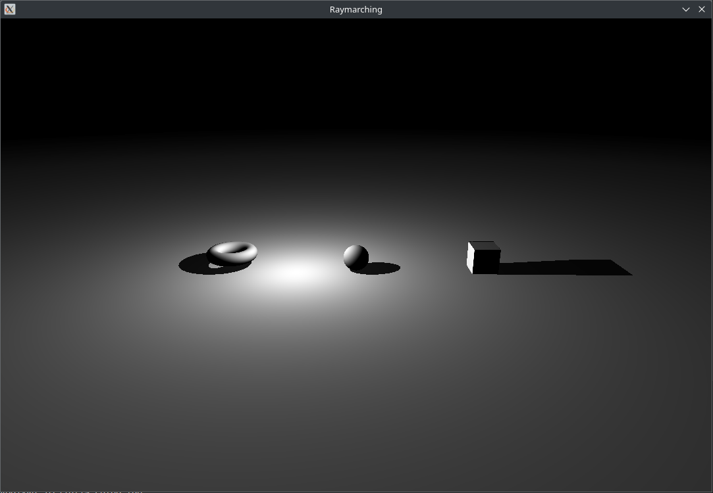

# Stellar

## Raymarching на Rust с Opengl и SDL2

Предназначен для школьного проекта



## Сборка

Библиотеки для SDL2 под windows и linux дистрибутивы находятся в `gnu-mingw` и `msvc`, настраивать их отдельно нет необходимости.

```
cargo build --release
``` 